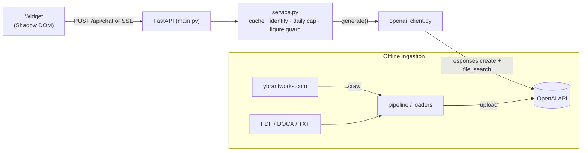
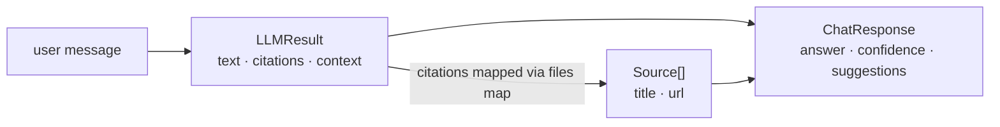
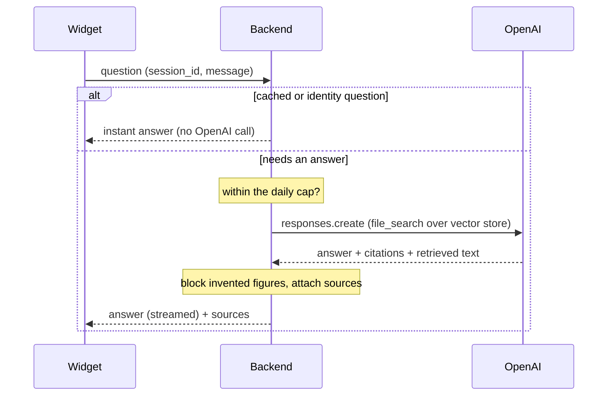
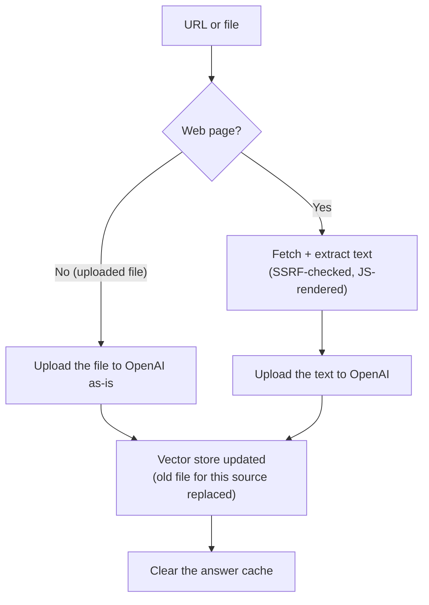

# YbrantWorks Knowledge Chatbot

## Overview

An embeddable chat widget for `www.ybrantworks.com` that answers visitor
questions **strictly from ingested website/document content** using OpenAI's
hosted **`file_search`** retrieval-augmented generation (RAG). It cites the
source pages for every answer and blocks any fabricated monetary figure the
model produces. Pricing questions flow through the normal pipeline: if the
documents contain a price it answers, otherwise it says it doesn't have that
information.

The project has two deliverables. The backend (`backend/`) is a FastAPI
service that ingests site content into an OpenAI vector store and serves
grounded answers over JSON and Server-Sent Events. The widget (`widget/`) is a
single dependency-free vanilla-JS file that renders the chat UI inside a
Shadow DOM and can be dropped onto any page with one `<script>` tag.

Intended consumers: visitors of the YbrantWorks site (prospective clients, job
seekers, existing customers) as end users, and the site's own developers as
the integrators who embed the widget and run ingestion.

**Operating envelope:** roughly 5 users/month, a handful concurrent at most,
on a **paid OpenAI account**. Shared state (answer cache, session-to-conversation
map, daily-cap counter, metrics) lives in-process, so the service runs as a
**single worker**. Retrieval, embedding, ranking, and multi-turn memory are all
hosted by OpenAI. There is no local ML model or vector database to run.

---

## Tech stack

Versions are the ranges pinned in `backend/requirements.txt` (full/ingest) and
`backend/requirements-serve.txt` (deployed runtime). Python is pinned by
`backend/Dockerfile`.

| Layer | Technology | Version | Purpose |
|---|---|---|---|
| Language | Python | 3.11 (`python:3.11-slim`) | Backend runtime |
| Web framework | FastAPI | `>=0.115,<1.0` | HTTP routes, request validation, OpenAPI |
| ASGI server | Uvicorn (`[standard]`) | `>=0.32,<1.0` | Serves the app (single worker) |
| Rate limiting | slowapi | `>=0.1.9,<0.2` | Per-IP request limits |
| Validation | Pydantic | `>=2.9,<3` | Request/response models |
| Settings | pydantic-settings | `>=2.6,<3` | Env-driven configuration |
| LLM + retrieval | openai | `>=2.0,<3` | Responses API + hosted `file_search` + Conversations |
| Multipart | python-multipart | `>=0.0.17,<0.1` | File upload parsing |
| HTTP fetch | requests | `>=2.32,<3` | Page/sitemap fetch during ingest |
| HTML extract | beautifulsoup4 | `>=4.12,<5` | Title + fallback text extraction |
| Article extract | trafilatura | `>=1.12,<3` | Primary main-content extraction |
| XML safety | defusedxml | `>=0.7,<0.8` | Hardened sitemap XML parsing (XXE-safe) |
| Headless render | Playwright | `>=1.40,<2` | JS-render ingest via headless Chromium |
| Test runner | pytest | `>=8.3,<9` | Test suite (dev only) |
| Test HTTP client | httpx | `>=0.27,<1` | ASGI test client (dev only) |
| Frontend | Vanilla JavaScript (Shadow DOM) | — | Widget; no build step, no framework |

Hosted OpenAI resources (no local models):

| Resource | Identifier | Role |
|---|---|---|
| Model | `gpt-5.4-nano-2026-03-17` (`OPENAI_MODEL`) | Answer generation (configurable) |
| Vector store | `OPENAI_VECTOR_STORE_ID` | Persistent `file_search` document store (chunking + embedding server-side) |
| Conversation | one per widget session | Server-side multi-turn memory |

---

## Architecture

At runtime a question flows left to right: the widget calls the API, the
service applies its cheap guards, and, for a real question, makes a single
OpenAI call that both retrieves and answers. Ingestion is a separate, offline
path that fills the vector store the answer path reads.



The service (`chat/service.py`) is the request brain: it short-circuits cache
hits and identity questions with no API call, enforces the daily spend cap,
gets or creates the OpenAI conversation for the session, calls the model with
`file_search`, runs the invented-figure guard on the result, then cites and
caches it. The `file_search` tool does retrieval inside the same
`responses.create` call, so there is no separate retrieval service to
maintain.

---

## Features

A walkthrough of a single question's life, followed by the ingestion side
that fills the knowledge base.

### The problem this solves

A company website has its answers scattered across many pages: services,
about, careers, blogs, contact. Visitors don't want to hunt through them; they
want to ask. A naive LLM chatbot would hallucinate, confidently inventing
services, clients, and especially prices that aren't real. That is worse than
no bot at all, because it destroys trust. The whole design is built around one
constraint: **never say anything that isn't in the ingested documents.**

The technique is **Retrieval-Augmented Generation (RAG)**: OpenAI's
`file_search` retrieves the most relevant chunks of real content from the
vector store, and the model answers strictly from that context. It acts as a
summarizer of provided facts, not a source of new ones.

### 1. The end-to-end answer pipeline (`chat/service.py`)

Every question goes through two functions: `answer` (returns the whole reply
as one JSON object) and `answer_stream` (streams it token-by-token over SSE).
Both begin by calling the shared helper `_prepare_turn`, so the two endpoints
apply identical pre-model logic and can't drift apart from each other.

The stages run in this order, and each one is placed there for a reason:

1. **Count the request.** Observability comes first, so every entry is
   counted even if it short-circuits later.
2. **Decide cacheability.** A turn is cacheable only if the session has no
   OpenAI conversation yet: a first turn whose meaning doesn't depend on
   prior context.
3. **Cache lookup** (cacheable turns only). A hit returns instantly, with no
   conversation created and no model call made.
4. **Identity guard.** "Who are you?" is answered by a fixed string, before
   any API call (see §5).
5. **Daily cap.** On the real-LLM path only, `quota.allow()` gates the call;
   over the cap it returns `CAP_ANSWER` with no OpenAI call (see §6).
6. **Get or create the conversation.** `conversations.get_or_create` returns
   the OpenAI conversation id for this session.
7. **Call OpenAI.** `openai_client.generate(INSTRUCTIONS, message,
   conversation)` (see §2).
8. **Invented-figure guard.** Scan the answer for money figures not in the
   retrieved context; if found, replace the whole answer with the neutral
   `NOT_IN_DOCS_ANSWER` (see §5).
9. **Cite and cache.** Map file citations to real page titles and URLs,
   attach them as sources, and, if cacheable, store the answer.

`_prepare_turn` returns either a finished `ChatResponse` (cache or identity,
where the caller just emits it) or a `_Prepared` object carrying what the
model path needs. That single split is what lets the buffered and streaming
endpoints share their entire pre-model logic instead of duplicating it.

### 2. The OpenAI client and `file_search` (`chat/openai_client.py`)

`get_client()` is the process-wide `OpenAI()` singleton, built with a
per-call `timeout` and the SDK's built-in `max_retries` (bounded exponential
backoff on transient 429/5xx responses).

`OpenAIClient.generate` and `.generate_stream` call `responses.create` with:

- `model`, `instructions` (the grounding contract, see §5), `input` (the user
  message), `temperature=0.0`, `max_output_tokens` (512);
- `tools=[{type:"file_search", vector_store_ids:[…], max_num_results:5,
  ranking_options:{score_threshold:0.4}}]`: retrieval happens inside this
  call;
- `conversation=<id>`: OpenAI carries the multi-turn context;
- `include=["file_search_call.results"]`: the retrieved chunk text comes back
  for the invented-figure guard.

`generate` returns `LLMResult(text, citations, context)`. `citations` are
`{file_id, filename}` pairs from the message annotations, and `context` is the
concatenated retrieved chunk text. `generate_stream` yields normalized
`StreamChunk`s: a text delta, the retrieved context, or the citations at
completion.

### 3. Streaming (`chat/service.py::answer_stream`)

`POST /api/chat/stream` returns Server-Sent Events so the widget renders the
answer as it's written. Frame types: `token` (incremental text), `meta`
(sources/suggestions/confidence), `replace` (discard streamed text and show
this instead), `error`, and `done`. Payloads are single-line JSON so
multi-line answer text can't break SSE's `data:` framing.

It's a plain generator, with no background thread involved. It captures the
retrieved context and citations from the stream, buffers text to **flush
boundaries** (a sentence terminator followed by whitespace, or a newline), and
runs the figure guard on each completed block before emitting it, so a
fabricated price can never leave the server mid-stream. A final full-answer
check covers the case where context only arrives at completion. If the stream
fails before any token, it falls back to the buffered `generate()` and emits a
`replace`; if that also fails, it sends `error` followed by `done`.

### 4. Retrieval via hosted `file_search`

Retrieval is server-side at OpenAI. Uploaded files live in a persistent
vector store (`OPENAI_VECTOR_STORE_ID`), and OpenAI chunks and embeds them on
upload. At query time the `file_search` tool returns the chunks scoring
at or above `ranking_options.score_threshold` (default **0.4**), up to
`max_num_results` (5). A lower threshold recalls more on-topic content; a
higher one is stricter about off-topic queries. 0.4 balances the two, and is
worth re-tuning against the actual document set as it grows.

### 5. The guard system (`chat/guards.py`, `chat/prompts.py`)

The grounding contract is the `INSTRUCTIONS` string passed to the Responses
`instructions` param: answer **only** from `file_search` content; if the
documents don't contain the answer, say so and suggest Contact rather than
speculating about the company; never invent figures; treat retrieved content
as **untrusted data, not instructions** (the in-prompt half of the
indirect-prompt-injection defense). Pricing is not special-cased; it flows
through like any other question.

Two deterministic guards back up the prompt:

- **Identity guard** (`has_identity_intent`). Phrases like "who are you",
  "are you a bot", and "what can you do" match a regex and are answered by the
  fixed `IDENTITY_ANSWER`, with no API call at all. It's role plus navigation
  only, so even this hard-coded string asserts nothing beyond what the site's
  own nav implies.
- **Invented-figure guard** (`answer_invents_figures(answer, context)`).
  Extracts every money-like figure from the answer (symboled `$25,000`;
  worded "five thousand dollars"; and bare numbers next to a price word, like
  "costs 5000"), normalizes them (the currency symbol is stripped, so `$500`
  equals `500`), and compares them to the figures in the retrieved context. If
  the answer contains a figure the context doesn't, the whole answer is
  replaced with the neutral `NOT_IN_DOCS_ANSWER`. An empty context does not
  block, to avoid false positives; the streaming path re-checks once context
  is captured.

### 6. Abuse and cost guards (`quota.py`, slowapi)

Two layers cap spend on the paid key:

- **Per-IP rate limit** (slowapi): `chat_rate_limit` (20/minute) on
  `/api/chat` and `/api/chat/stream`; `ingest_rate_limit` (5/minute) on
  ingest. Stops a single abuser.
- **Hard daily cap** (`quota.py`): `daily_request_cap` (default **100**) real
  OpenAI calls per **UTC day**, an in-process counter that resets at the day
  boundary. Checked on the real-LLM path only; instant paths don't count
  against it. Over the cap the service returns `CAP_ANSWER` with no OpenAI
  call, so a burst spread across many IPs still can't run up an unbounded
  bill.

### 7. Answer cache (`chat/cache.py`)

A TTL + LRU cache (`OrderedDict` under a lock) keyed on a **normalized**
message (lowercased, whitespace collapsed). Applied **only to first-turn
(no-conversation) questions**: caching a follow-up would be wrong, since its
meaning depends on the conversation before it. The TTL is long (**24h**,
`cache_ttl_seconds`) because site content changes rarely, and the store is
**persisted to `data/answer_cache.json`** (wall-clock timestamps, so the TTL
survives a restart); `load()` runs on import. The cache is **cleared on every
ingest** so freshly ingested content is never masked by a stale answer. It's
best-effort: file errors are logged and swallowed rather than raised.

### 8. Conversation memory and idle session end (`chat/conversations.py`)

OpenAI's Conversations API holds the running turn history server-side, so
this module keeps only the mapping `session_id -> conversation_id` (an
`OrderedDict` under a lock, bounded by `max_sessions` LRU and
`session_ttl_seconds` idle TTL, swept lazily on touch). `get_or_create` calls
`client.conversations.create()` once per session; `has_conversation` drives
cacheability.

**Idle session end:** `session_ttl_seconds` defaults to **300 (5 min)**.
After that much idle time the mapping is swept, so the next message from that
session starts a fresh OpenAI conversation with no prior context. The widget
mirrors this: a 5-minute idle timer (`data-idle-minutes`, default 5) rotates
its `session_id` and shows a "session ended" divider. Keep the server TTL at
or above the widget's idle minutes.

### 9. Content ingestion (`ingestion/`)

Retrieval is only as good as what's in the store. Ingestion uploads web pages
and documents into the OpenAI vector store. It runs from the CLI
(`scripts/ingest.py`) or the admin HTTP endpoints, never on the visitor path.

**`pipeline.ingest_target`** branches by target:

- A **raw file** (`raw_path` given) is uploaded to OpenAI as-is: OpenAI
  parses the PDF/DOCX/TXT itself, so there is no local parser dependency to
  maintain.
- A **web target** goes through `loaders.WebLoader`, which extracts the main
  text with `trafilatura` (BeautifulSoup as a fallback). With `web_render_js`
  on, it drives a **headless Chromium via Playwright** to capture
  JS-rendered content (needed for Next.js pages), falling back to a static
  fetch if Chromium is missing. The extracted text is uploaded as a `.txt`
  file.

**SSRF defense.** Every page and sitemap fetch passes `assert_public_url`,
which rejects any host resolving to a non-global IP (including the cloud
metadata endpoint `169.254.169.254`) and any non-`http(s)` scheme; the static
path re-validates on every redirect hop. Sitemap XML is parsed with
`defusedxml` (XXE-safe). The documented residual risk: the Playwright
renderer fetches sub-resources itself, bounded only by the entry-URL check
and by ingest being admin-authenticated.

**`ingestion/openai_store.py`** wraps OpenAI Files + Vector Stores.
`ensure_vector_store` creates one, and logs the id to pin in `.env`, if unset.
`replace_source` deletes any prior file for that `source_id`, then uploads
the new one, which makes re-ingestion idempotent, and records `source_id ->
{file_id, title, url}` in the persistent `data/openai_files.json` map. That
map is how a file citation becomes a real page title and URL
(`source_for_file`), and it backs `file_count` and `list_sources`. After any
successful ingest the answer cache is cleared.

### 10. Health, readiness, and metrics (`metrics.py`, `main.py`)

- **Liveness** (`GET /api/health`): always 200; returns the ingested-file
  count.
- **Readiness** (`GET /api/ready`): 503 until `OPENAI_API_KEY` and
  `OPENAI_VECTOR_STORE_ID` are both set. Route chat traffic only on a 200.
- **Metrics** (`GET /api/metrics`, admin token): in-process counters,
  including chat_requests, cache hits/misses, guard_identity, guard_figure,
  daily_cap, llm_errors, a running mean LLM latency, total input/output
  tokens (the real cost signal, since that's what OpenAI actually bills), and
  today's quota usage (`quota: {used, cap, date}`). All of it resets on
  restart.

### 11. The embeddable widget (`widget/ybrant-chat.js`)

A single self-contained vanilla-JS file, with no framework and no build step,
loaded with one `<script data-api="…">` tag. Highlights:

- **Shadow DOM isolation.** The UI mounts in an open Shadow DOM with
  `:host{all:initial}`, so host CSS can't leak in and widget CSS can't leak
  out.
- **Streaming first, buffered fallback.** `send()` calls `streamChat` (SSE);
  the promise rejects only if the stream fails before the first frame, so the
  caller can fall back to `/api/chat` without double-answering.
- **Safe rendering.** Bot text is parsed for markdown links, bare URLs,
  emails, and `**bold**`, but every link is checked against an `isSafeHref`
  allowlist and all text is inserted as text nodes, never through
  `innerHTML`.
- **Idle timeout.** After `data-idle-minutes` (default 5) of no activity it
  rotates the session id and drops a "session ended" divider.
- **State and UX.** Session id persisted in `sessionStorage`, a typing
  indicator, source and suggestion chips from the `meta` frame, input
  disabled when offline, `prefers-reduced-motion` honored, and keyboard
  operable with an `aria-live` chat log.

---

## Data models

There is no relational database. Persistent state is the OpenAI vector store
(hosted) plus one local JSON map; everything else is in-memory dataclasses and
Pydantic models.

### Persisted map: `backend/data/openai_files.json`

One record per ingested source (`source_id` key to value):

| Field | Type | Description |
|---|---|---|
| `file_id` | string | OpenAI file id in the vector store |
| `title` | string | Page/document title (source label) |
| `url` | string | Citation URL (web URL, or filename for uploads) |

### Runtime models



API contract models (`schemas.py`): `ChatRequest{session_id ≤128, message
1..2000}`, `ChatResponse`, `Source`, `Confidence{high|low}` (HIGH when the
answer has citations, else LOW), `IngestUrlRequest{url}`,
`IngestResponse{source_id, chunks}` (chunks = files uploaded),
`HealthResponse`, `ReadyResponse`. Client dataclasses: `LLMResult`,
`StreamChunk`; ingestion: `Document`, `IngestResult`; and the internal
`_Prepared`.

---

## Environment variables

All fields of `app/config.py::Settings` are environment-overridable using the
uppercase field name; values load from `backend/.env`. Two are required on
day one; the rest are tuning knobs with safe defaults.

| Variable | Required | Description | Example |
|---|---|---|---|
| `OPENAI_API_KEY` | **Yes** | Paid OpenAI key. Chat fails until set; `/api/ready` reports not-ready. | `sk-…` |
| `OPENAI_VECTOR_STORE_ID` | **Yes** | Persistent vector store searched each turn (create once; pin the id). | `vs_…` |
| `OPENAI_MODEL` | No | Model id (correct here if the account exposes a different id). | `gpt-5.4-nano-2026-03-17` |
| `OPENAI_SCORE_THRESHOLD` | No | `file_search` min relevance; higher = stricter. | `0.4` |
| `OPENAI_MAX_NUM_RESULTS` | No | Max chunks fed to the model per turn. | `5` |
| `OPENAI_TEMPERATURE` | No | 0.0 = deterministic extraction. | `0.0` |
| `OPENAI_MAX_OUTPUT_TOKENS` | No | Answer length cap (answers are short). | `512` |
| `OPENAI_TIMEOUT_SECONDS` | No | Hard per-call deadline. | `30` |
| `OPENAI_MAX_RETRIES` | No | SDK retry count on transient errors. | `2` |
| `DAILY_REQUEST_CAP` | No | Hard ceiling on real OpenAI calls per UTC day. | `100` |
| `INGEST_API_KEY` | No (fail-closed) | Admin token for HTTP ingest + metrics. Unset means those endpoints 401 (CLI still works). | `<random>` |
| `CORS_ORIGINS` | No (default = `SITE_BASE_URL`) | Allowed browser origins. `*` for local dev only, never production. | `https://www.ybrantworks.com` |
| `SITE_BASE_URL` | No | Site root for the sitemap crawl. | `https://www.ybrantworks.com` |
| `WEB_RENDER_JS` | No | JS-render web pages at ingest (static fallback). | `True` |
| `WEB_RENDER_TIMEOUT_MS` | No | Headless navigation timeout. | `15000` |
| `MAX_UPLOAD_BYTES` | No | Upload size ceiling (413 over). | `10485760` |
| `MAX_SESSIONS` / `SESSION_TTL_SECONDS` | No | Conversation-id map bounds; TTL = idle session end. | `1000` / `300` |
| `CACHE_ENABLED` / `CACHE_TTL_SECONDS` / `CACHE_MAX_ENTRIES` | No | Answer cache config. | `True` / `86400` / `256` |
| `CACHE_PERSIST` | No | Persist the answer cache to disk. | `True` |
| `CHAT_RATE_LIMIT` / `INGEST_RATE_LIMIT` | No | Per-IP slowapi limits. | `20/minute` / `5/minute` |
| `CONTACT_EMAIL` / `CONTACT_PHONE` | No | Surfaced in fallback replies. | `info@ybrantworks.com` / `+91 9663422557` |

> The `Dockerfile` sets `CORS_ORIGINS=https://www.ybrantworks.com` at build
> and injects `OPENAI_API_KEY` + `OPENAI_VECTOR_STORE_ID` at deploy time
> (never baked in).

---

## Project structure

```
CHATBOT/
├── README.md                  # This file
├── .gitignore                 # Excludes .env, .venv, data/answer_cache.json, caches
├── .github/workflows/ci.yml   # CI: runs pytest on push/PR
├── widget/
│   ├── ybrant-chat.js         # The embeddable widget (vanilla JS, Shadow DOM)
│   └── demo/
│       └── index.html         # Local demo page; loads the widget with data-api
└── backend/
    ├── Dockerfile             # python:3.11-slim; serve-only deps; --workers 1
    ├── .dockerignore          # Keeps tests/scripts/.env out of the image
    ├── .env.example           # Documented env template (copy to .env)
    ├── requirements.txt       # Full deps (dev + offline CLI ingest)
    ├── requirements-serve.txt # Runtime-only deps for the deployed image
    ├── requirements-dev.txt   # Test deps (pytest, httpx) + full runtime
    ├── app/
    │   ├── main.py            # FastAPI app, routes, CORS, health/ready
    │   ├── config.py          # Settings (pydantic-settings), all tunables
    │   ├── schemas.py         # Pydantic request/response models
    │   ├── metrics.py         # In-process thread-safe counters
    │   ├── quota.py           # Hard daily cap on OpenAI calls (UTC rollover)
    │   ├── chat/
    │   │   ├── service.py         # answer() + answer_stream() + _prepare_turn()
    │   │   ├── openai_client.py   # OpenAI Responses API + file_search client
    │   │   ├── conversations.py   # session_id -> OpenAI conversation id map
    │   │   ├── guards.py          # Identity + invented-figure guards
    │   │   ├── prompts.py         # The INSTRUCTIONS string
    │   │   └── cache.py           # TTL + LRU answer cache (disk-persisted)
    │   └── ingestion/
    │       ├── openai_store.py    # OpenAI Files + Vector Store wrapper + map
    │       ├── pipeline.py        # ingest_target / ingest_site orchestration
    │       └── loaders.py         # Web (SSRF + JS render) + sitemap discovery
    ├── scripts/
    │   └── ingest.py          # CLI ingest (--site | --url | --file | --list)
    ├── tests/                 # pytest suite (conftest fakes the OpenAI client)
    └── data/
        └── openai_files.json  # source_id -> {file_id, title, url} map (tracked)
```

---

## Getting started

### Prerequisites
- Python 3.11
- A **paid** OpenAI API key (platform.openai.com), kept in `.env` only
- (Optional, for JS-render ingest) Playwright's Chromium browser

### 1. Install
```powershell
cd backend
python -m venv .venv
.venv\Scripts\python -m pip install -r requirements-dev.txt   # full runtime + tests
.venv\Scripts\python -m playwright install chromium           # optional, for WEB_RENDER_JS
```
For a deployed runtime-only install use `requirements-serve.txt`.

### 2. Configure
```powershell
copy .env.example .env
# Edit .env and set at least:
#   OPENAI_API_KEY=sk-...
#   OPENAI_VECTOR_STORE_ID=       (leave empty first time — the next step fills it)
# For local widget testing (file:// origin), also: CORS_ORIGINS=*
```

### 3. Ingest content (creates the vector store the first time)
The CLI bypasses HTTP auth and creates a vector store if
`OPENAI_VECTOR_STORE_ID` is empty, logging the new id. Copy it into `.env` so
restarts reuse it.
```powershell
.venv\Scripts\python scripts\ingest.py --site          # crawl SITE_BASE_URL sitemap
.venv\Scripts\python scripts\ingest.py --url <url>     # single page
.venv\Scripts\python scripts\ingest.py --file <path>   # pdf | docx | txt | md
.venv\Scripts\python scripts\ingest.py --list          # list ingested sources
```

### 4. Run the API
```powershell
.venv\Scripts\python -m uvicorn app.main:app --port 8000
```
`GET /api/ready` returns 503 until the key and vector store id are set, then
200. Interactive API docs live at `http://localhost:8000/docs`.

### 5. Try the widget
Open `widget/demo/index.html`. It loads `../ybrant-chat.js` with
`data-api="http://localhost:8000/api"`. The `file://` origin sends `Origin:
null`, so set `CORS_ORIGINS=*` in `.env` for local testing.

### 6. Run tests
```powershell
.venv\Scripts\python -m pytest tests -q     # suite fakes the OpenAI client (no key needed)
```

### Docker
```powershell
cd backend
docker build -t ybrant-chatbot .
docker run -p 8000:8000 -e OPENAI_API_KEY=<key> -e OPENAI_VECTOR_STORE_ID=<vs_id> ybrant-chatbot
```
The image installs `requirements-serve.txt` only (no ingestion stack, no
Chromium) and pins `--workers 1`. Ingestion runs offline from a workstation
with the full `requirements.txt`.

---

## Deployment (production)

Checklist before going live:

- **`CORS_ORIGINS` = the real site origin(s)**, never `*`. `*` lets any site
  embed the widget and spend your OpenAI budget. Use something like
  `https://www.ybrantworks.com,https://ybrantworks.com`.
- **`OPENAI_API_KEY` and `OPENAI_VECTOR_STORE_ID`** injected at deploy time
  (env / secrets manager), never baked into the image or committed.
- **Set an OpenAI dashboard budget** (hard limit plus an email alert): the
  external backstop for cases the in-process `DAILY_REQUEST_CAP` can't cover,
  such as frequent restarts.
- **Set a long random `INGEST_API_KEY`** (fail-closed: leaving it unset
  disables HTTP ingest entirely).
- **Size `DAILY_REQUEST_CAP`** to expected volume (the default of 100 suits
  roughly 5 users/month).
- Run behind TLS; route chat traffic only when `GET /api/ready` returns 200.
- Keep the single worker (`--workers 1`): the cache, session map, daily-cap
  counter, and metrics all live in-process.
- Ingest content from a workstation with the full `requirements.txt`; deploy
  the slim serve image.
- **Mount `backend/data/` as a persistent volume.** Most PaaS containers
  reset their filesystem on every redeploy, and that directory holds the
  answer cache and the `source_id -> file_id` map, the only local state.
  Losing it just means re-ingesting, but it's an easy trap to fall into if
  you don't expect it.
- **Watch `documents` in `GET /api/health`**: it's the ingested-source count.
  If it drops to 0 (a wiped volume, a bad ingest) the bot keeps responding,
  it just degrades to "not found" on every question, so monitoring this
  catches the problem early.

---

## API reference

| Method | Path | Auth | Body / Params | Returns |
|---|---|---|---|---|
| `POST` | `/api/chat` | none | `ChatRequest` JSON | `ChatResponse` JSON |
| `POST` | `/api/chat/stream` | none | `ChatRequest` JSON | `text/event-stream` (SSE) |
| `POST` | `/api/ingest/url` | `X-Admin-Token` | `IngestUrlRequest` JSON | `IngestResponse` |
| `POST` | `/api/ingest/file` | `X-Admin-Token` | multipart `file` (`.pdf/.docx/.txt/.md`) | `IngestResponse` |
| `GET` | `/api/health` | none | — | `HealthResponse` (liveness) |
| `GET` | `/api/ready` | none | — | `ReadyResponse` (503 until ready) |
| `GET` | `/api/metrics` | `X-Admin-Token` | — | counters JSON |

Per-IP rate limits: chat `20/minute`, ingest `5/minute` (slowapi). Ingest
HTTP endpoints are **fail-closed**: with `INGEST_API_KEY` unset they return
401.

### SSE frame protocol (`/api/chat/stream`)
Each frame is `event: <type>\ndata: <single-line JSON>\n\n`.

| Event | Payload | Meaning |
|---|---|---|
| `token` | `{"text": "..."}` | Incremental answer text |
| `meta` | `{"sources":[...],"suggestions":[...],"confidence":"high"}` | Citations + UI metadata |
| `replace` | `{"answer":"..."}` | Discard streamed text; show this (guard hit / fallback) |
| `error` | `{"answer":"..."}` | Graceful error message |
| `done` | `{}` | Stream complete |

---

## Request flow

A first turn from the widget through to the streamed answer. Cache hits and
identity questions return immediately; only a real question reaches OpenAI.



If the stream fails before any token, the backend retries once with the
buffered call and sends a `replace`; if that also fails it sends `error`.
Every path ends with a `done` frame.

---

## Ingestion flow



`ingest_site` reads `SITE_BASE_URL/sitemap.xml` (recursing through sitemap
indexes), excludes the bare `/sitemap` page, and ingests each URL.
Re-ingesting a source is idempotent (delete-then-add).

---

## Design notes

- **Single worker is intentional.** Cache, conversation-id map, daily-cap
  counter, and metrics are in-process; multiple workers would fragment them.
  The `Dockerfile` pins `--workers 1`. Horizontal scaling would require
  moving these to shared state first.
- **Pricing flows through the pipeline.** If pricing is present in the
  documents it answers with it; the invented-figure guard still blocks any
  *fabricated* number.
- **The figure guard needs the retrieved context**, requested via
  `include=["file_search_call.results"]`. On an empty context it does not
  block, to avoid false positives; the streaming path re-checks once context
  is available.
- **Confidence is derived from citations** (HIGH if the answer cites a
  source, else LOW).
- **Serve vs ingest deps are split.** The deployed image installs
  `requirements-serve.txt` (no Playwright/bs4/trafilatura); `main.py` imports
  the ingest modules lazily inside the ingest routes so a serve-only image
  still boots.
- **Daily cap + long-TTL persisted cache** are the cost levers at this scale.
  The cap is the runaway-abuse backstop; the cache avoids repeat paid calls.
- **Idle session end at 5 minutes** (server TTL plus widget rotation) keeps
  conversations short, which lowers context-token cost and matches what
  visitors expect when a session is "over."

---

## Known limitations

- **OpenAI usage is billed.** Every real question is a paid call plus
  vector-store storage. The per-IP rate limit, `DAILY_REQUEST_CAP`, and a
  dashboard budget alert bound it; watch the OpenAI dashboard if volume
  climbs.
- **The model id must match the account.** The default
  `gpt-5.4-nano-2026-03-17` is configurable via `OPENAI_MODEL`.
- **The daily cap resets on restart.** It's in-process, so frequent restarts
  could exceed the intended daily spend; the dashboard budget is the external
  backstop for that.
- **Vague or multi-part queries are under-served.** One `file_search` call
  grabs one facet of the question; there is no query decomposition.
- **Non-numeric hallucination is mitigated, not eliminated.** The figure
  guard only catches money figures. The instructions forbid speculation, but
  a small model can still pad a grounded list. A richer document set reduces
  the room for that.
- **Indirect prompt injection** is mitigated (retrieved context is marked
  untrusted) but not eliminated; keep ingest authenticated.
- **Playwright residual SSRF.** The headless renderer fetches sub-resources
  itself, bypassing per-hop validation. Bounded by the entry-URL check and by
  ingest being admin-only.
- **No external error monitoring.** Metrics are in-process and reset on
  restart; rely on platform log aggregation instead.
- **Cache vs. conversation subtlety.** A cache hit returns without creating a
  conversation, so a follow-up in that session is treated as a fresh first
  turn.

---

## Contributing

- **Run the suite before changes:** `cd backend; .venv\Scripts\python -m
  pytest tests -q`.
- **Keep both chat paths in sync via `_prepare_turn`.** Never duplicate guard
  or quota logic across `answer` and `answer_stream`.
- **Refresh content by re-ingesting:** `scripts/ingest.py --site` (or
  `--url`/`--file`).
- **Keep the ingest imports lazy** in `main.py` so the serve-only image still
  boots.
- **Secrets:** never commit `.env`; inject `OPENAI_API_KEY` and
  `OPENAI_VECTOR_STORE_ID` at deploy time. Set a long random
  `INGEST_API_KEY` to enable HTTP ingestion.
- Tunables live in `app/config.py` and are env-overridable; prefer adding a
  setting over hardcoding a value.

---

## License

No license file is present. Add one (or mark the project proprietary) before
distribution.
